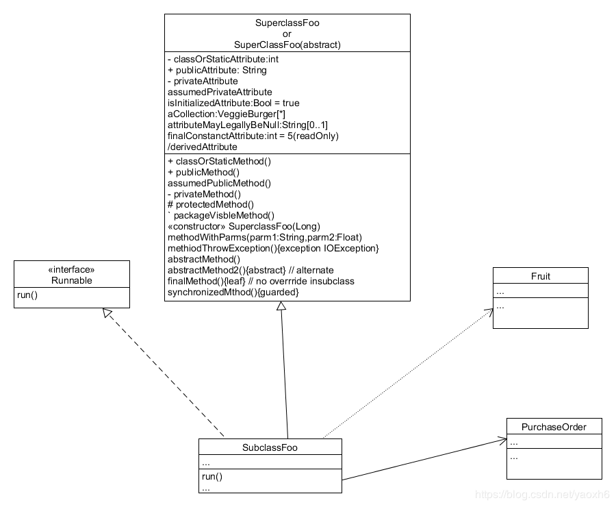

## 简答题

1. 用简短的语言给出对分析、设计的理解。

    软件分析不是发现更多的功能与需求，而是确认有效的功能与需求，去伪存真不断满足客户需要。软件设计也不是追求最先进技术，而是控制变化附加的成本，使得软件生产的预算、时间等能在掌控之中。
2. 用一句话描述面向对象的分析与设计的优势。

    根据流行的统一过程指南，现代软件工程中的OOAD最好是以迭代和增量的方式进行。通过迭代，OOAD活动的输出、OOA的分析模型和OOD的设计模型将在风险和业务价值等关键因素的驱动下不断地被细化和发展。
3. 简述 UML（统一建模语言）的作用。考试考哪些图？

    统一建模语言是非专利的第三代建模和规约语言。UML是一种开放的方法，用于说明、可视化、构建和编写一个正在开发的、面向对象的、软件密集系统的制品的开放方法。UML展现了一系列最佳工程实践，这些最佳实践在对大规模，复杂系统进行建模方面，特别是在软件架构层次已经被验证有效。
4. UML九种图：

    用例视图、用例图、设计视图、类图、对象图、进程视图、序列图、协作图、状态图、活动图、实现视图、构件图、拓扑视图、部署图
5. 从软件本质的角度，解释软件范围（需求）控制的可行性

    软件的本质是复杂性、不可见性、不一致性、可变性，所以软件需求分析就是把软件计划期间建立的软件可行性分析求精和细化，分析各种可能的解法，并且分配给各个软件元素。需求分析是软件定义阶段中的最后一步，是确定系统必须完成哪些工作，也就是对目标系统提出完整、准确、清晰、具体的要求。

## 项目管理实践

1. 看板使用练习（提交看板执行结果贴图，建议使用 Git project）

    

2. UML绘图工具练习（提交贴图，必须使用 UMLet）

+ 请在 参考书2 或 教材 中选择一个类图（给出参考书页码图号），中文版181页

    

